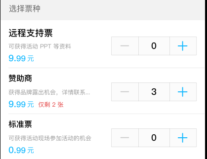
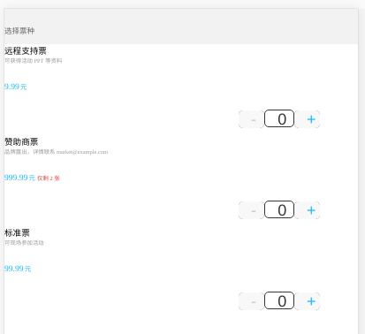

A broken example of Taro framework.

Expected:

Actual:

## To see the brokeness yourself

Enter fackapi subdirectory and run:

  node app.js
  
In the root directory of project (TaroExample), run:

  npm run dev:h5
  
Your browser need to enable CORS (via command line argument or plugin).

